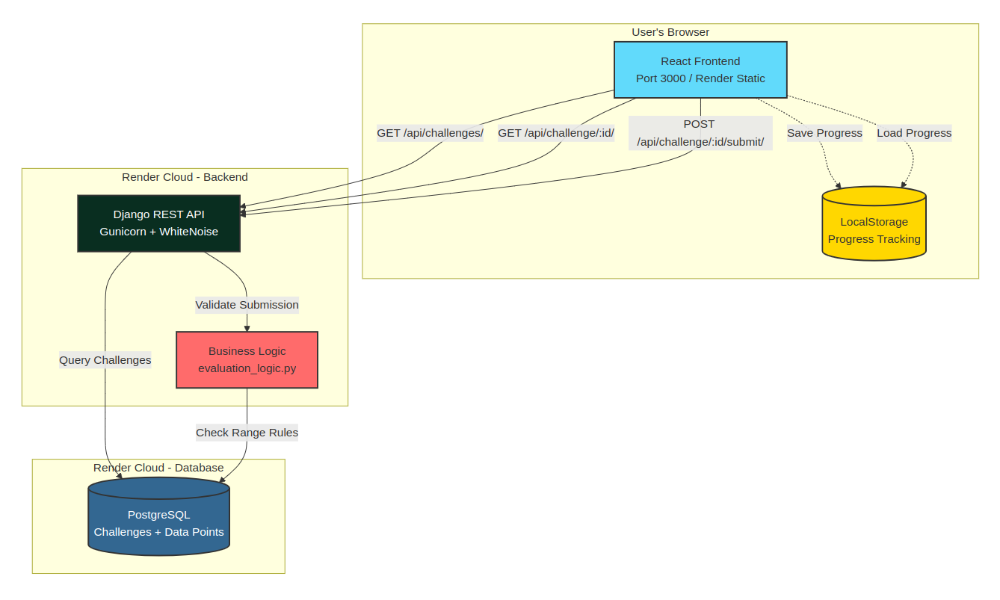

# Range Tutor - Technical Challenge Solution

**Live Demo:** https://range-tutor-frontend.onrender.com

## What This Is

An interactive educational web app that teaches the concept of "Range" in data visualization. Users drag bubbles on a chart to learn how the range (all Y-axis values) works through 3 progressive challenges.

## Tech Stack

**Frontend:**
- React 18 with hooks
- D3.js for interactive visualizations
- Axios for API calls
- CSS Modules for styling

**Backend:**
- Django 4.2 + Django REST Framework
- PostgreSQL database 
- 3 API endpoints for challenges

**Deployment:**
- Hosted on Render (free tier)
- Automatic deployments from GitHub

## Key Features Implemented

✅ **3 Challenge Types:**
- BETWEEN range 
- LESS_THAN range 
- GREATER_THAN range

✅ **Interactive Visualizations:**
- Drag-and-drop bubbles with D3.js
- Real-time Y-axis value updates
- Smooth animations and transitions

✅ **Progress Tracking:**
- LocalStorage-based persistence
- Progress bar showing completion
- Completed challenge indicators

✅ **Polish:**
- Dark mode support
- Responsive layout
- Clean, intuitive UI

## Architecture Overview



## API Endpoints

| Method | Endpoint | Description |
|--------|----------|-------------|
| GET | `/api/challenges/` | List all 3 challenges |
| GET | `/api/challenge/:id/` | Get challenge with initial data points |
| POST | `/api/challenge/:id/submit/` | Submit answer and get validation |

## Running Locally

### Backend
```bash
cd backend
python -m venv venv
source venv/bin/activate 
pip install -r requirements.txt
python manage.py migrate
python manage.py seed_data
python manage.py runserver
```
→ Backend runs at http://localhost:8000

### Frontend
```bash
cd frontend
npm install
npm start
```
→ Frontend runs at http://localhost:3000

## Project Structure

```
Scholé_Challenge/
├── backend/
│   ├── range_tutor/
│   │   ├── models.py              # Challenge & InitialDataPoint models
│   │   ├── views.py               # 3 API view classes
│   │   ├── serializers.py         # DRF serializers
│   │   ├── evaluation_logic.py    # Validation logic
│   │   └── management/commands/
│   │       └── seed_data.py       # Seeds 3 challenges with 27 points
│   └── tutor_project/settings.py  # Django config
│
├── frontend/
│   └── src/
│       ├── components/
│       │   ├── LandingPage/       # Challenge selection + progress
│       │   ├── TutorContainer/    # Challenge view wrapper
│       │   └── InteractiveBubbleChart/
│       │       ├── InteractiveBubbleChart.js
│       │       └── useD3.js       # D3 visualization logic
│       └── context/ThemeContext.js # Dark mode
│
└── render.yaml                     # Deployment config
```

## Key Technical Decisions

**Why D3.js?**
- Needed precise control over drag interactions
- Required custom animations for different hint types
- Native SVG manipulation for smooth performance

**Why LocalStorage for Progress?**
- No user authentication required
- Simple, works offline
- Meets requirements for demo purposes

**Challenge Validation Logic:**
- Backend calculates min/max of all Y values
- BETWEEN: `min >= rule_value_a AND max <= rule_value_b`
- LESS_THAN: `max < rule_value_a`
- GREATER_THAN: `min > rule_value_a`

- **GitHub:** https://github.com/woringer404v/Schol-_Challenge
- **Live App:** https://range-tutor-frontend.onrender.com
